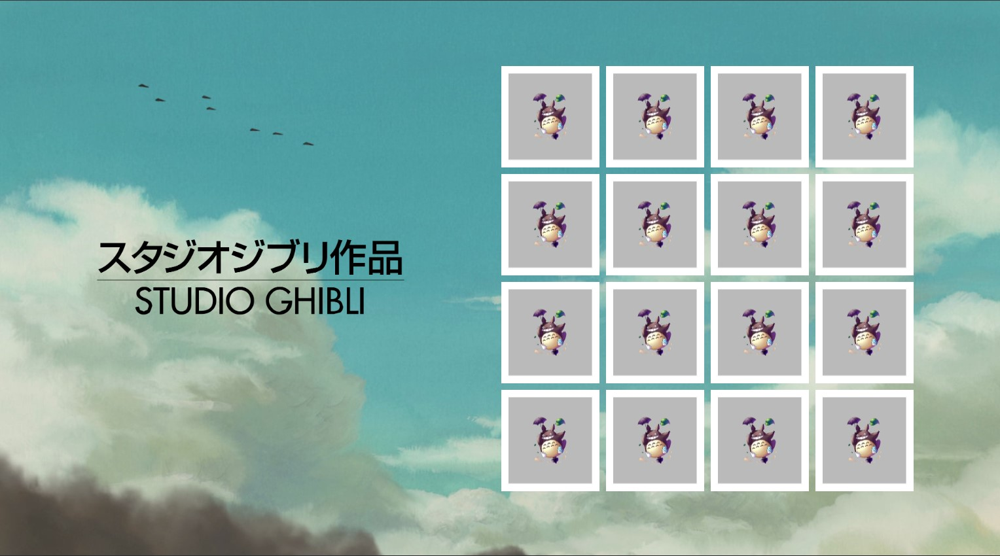
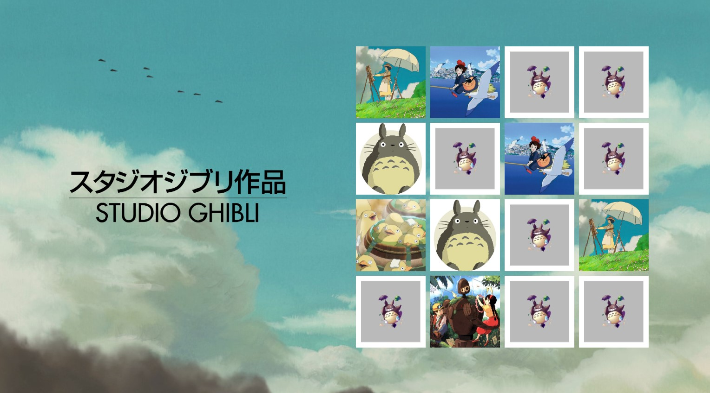
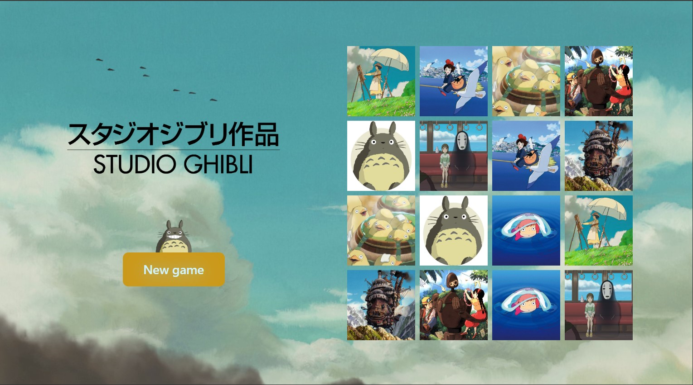

#Anime-Memory-Game
"Anime Memory Game" is an exciting and captivating game created using React and TypeScript, allowing you to test your memory and love for Studio Ghibli anime. In this game, you will need to uncover cards featuring characters from popular Studio Ghibli movies and animations and match them.

● Theme: Studio Ghibli Anime.

● Technologies: The game is developed using React and TypeScript to enhance data typing and ensure reliability.

● Interface: The gaming interface is stylized using styled components, making it visually appealing and user-friendly.

● Rules: Players flip cards with character images and search for pairs, trying to remember the location of each card. The goal of the game is to find all pairs with the fewest moves possible.

The Studio Ghibli team has created engaging and colorful character images, making this game not only interesting but visually appealing to all anime fans. Are you ready to test your memory and find all the pairs?

  

  

  

